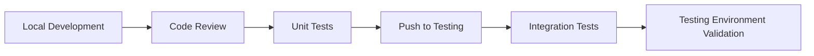
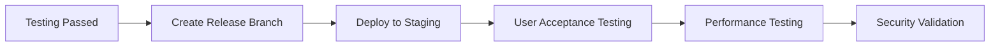
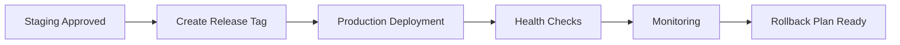

# 🚀 Environment Management & Release Process Guide

This guide covers how to set up and manage different environments (testing, staging, production) for the Bourracho project and establish a proper release process.

## 📋 Environment Overview

| Environment | Purpose | Database | Domain | Security Level |
|-------------|---------|----------|--------|----------------|
| **Local** | Development & unit testing | Local MongoDB | localhost:8000 | Minimal |
| **Testing** | Integration & automated tests | Test MongoDB | test.yourdomain.com | Medium |
| **Staging** | Pre-production validation | Staging MongoDB | staging.yourdomain.com | High |
| **Production** | Live application | Production MongoDB | yourdomain.com | Maximum |

## 🏗️ Environment Setup

### 1. Local Development Environment

**Purpose**: Day-to-day development and unit testing

```bash
# Use the development docker-compose
docker-compose up -d

# Environment variables (.env.local)
DEBUG=true
MONGO_ROOT_PASSWORD=dev_password
CORS_ALLOWED_ORIGINS=http://localhost:3000,http://localhost:5173
ALLOWED_HOSTS=localhost,127.0.0.1
```

**Features**:
- ✅ Debug mode enabled
- ✅ Relaxed CORS settings
- ✅ Simple passwords
- ✅ Database ports exposed for debugging
- ✅ Hot reload enabled

### 2. Testing Environment

**Purpose**: Automated testing, integration tests, CI/CD

```bash
# Use testing configuration
docker-compose -f docker-compose.test.yml up -d

# Environment variables (.env.test)
DEBUG=false
MONGO_ROOT_PASSWORD=test_secure_password
CORS_ALLOWED_ORIGINS=https://test-bourracho.vercel.app
ALLOWED_HOSTS=test.yourdomain.com
```

**Features**:
- ✅ Production-like configuration
- ✅ Isolated test database
- ✅ Automated test execution
- ✅ Performance monitoring
- ❌ No SSL (optional)

### 3. Staging Environment

**Purpose**: Final validation before production deployment

```bash
# Use staging configuration
docker-compose -f docker-compose.staging.yml up -d

# Environment variables (.env.staging)
DEBUG=false
MONGO_ROOT_PASSWORD=staging_secure_password_123!
CORS_ALLOWED_ORIGINS=https://staging-bourracho.vercel.app
ALLOWED_HOSTS=staging.yourdomain.com
```

**Features**:
- ✅ Identical to production setup
- ✅ SSL certificates
- ✅ Production-level security
- ✅ Performance monitoring
- ✅ Real user testing

### 4. Production Environment

**Purpose**: Live application serving real users

```bash
# Use production configuration
docker-compose -f docker-compose.prod.yml up -d

# Environment variables (.env.production)
DEBUG=false
MONGO_ROOT_PASSWORD=ultra_secure_production_password!
CORS_ALLOWED_ORIGINS=https://bourracho.vercel.app
ALLOWED_HOSTS=yourdomain.com
```

**Features**:
- ✅ Maximum security
- ✅ SSL/TLS encryption
- ✅ Rate limiting
- ✅ Monitoring & alerting
- ✅ Backup strategies
- ✅ High availability

## 🔄 Release Process Workflow

### Phase 1: Local Development → Testing



**Steps**:

1. **Develop locally**:
   ```bash
   # Start local environment
   docker-compose up -d
   
   # Run unit tests
   uv run pytest backend/tests/
   ```

2. **Code review & validation**:
   ```bash
   # Run linting
   uv run ruff check backend/
   
   # Run type checking (if applicable)
   # Commit changes
   git add .
   git commit -m "feat: add new feature"
   ```

3. **Deploy to testing**:
   ```bash
   # Build and deploy to testing environment
   docker-compose -f docker-compose.test.yml build
   docker-compose -f docker-compose.test.yml up -d
   
   # Run integration tests
   uv run pytest backend/tests/integration/
   ```

### Phase 2: Testing → Staging



**Steps**:

1. **Create release branch**:
   ```bash
   git checkout -b release/v1.2.0
   git push origin release/v1.2.0
   ```

2. **Deploy to staging**:
   ```bash
   # Copy production-like environment
   cp .env.production .env.staging
   
   # Update staging-specific values
   sed -i 's/yourdomain.com/staging.yourdomain.com/g' .env.staging
   sed -i 's/bourracho.vercel.app/staging-bourracho.vercel.app/g' .env.staging
   
   # Deploy
   docker-compose -f docker-compose.staging.yml up -d
   ```

3. **Validation checklist**:
   - [ ] All features work as expected
   - [ ] Performance meets requirements
   - [ ] Security scan passes
   - [ ] User acceptance testing complete
   - [ ] Database migration successful
   - [ ] Backup/restore tested

### Phase 3: Staging → Production



**Steps**:

1. **Create release tag**:
   ```bash
   git tag -a v1.2.0 -m "Release version 1.2.0"
   git push origin v1.2.0
   ```

2. **Production deployment**:
   ```bash
   # Backup current production
   ./scripts/backup-production.sh
   
   # Deploy new version
   docker-compose -f docker-compose.prod.yml pull
   docker-compose -f docker-compose.prod.yml up -d
   
   # Verify deployment
   ./scripts/health-check.sh
   ```

3. **Post-deployment validation**:
   - [ ] Health checks pass
   - [ ] SSL certificates valid
   - [ ] Database connectivity confirmed
   - [ ] API endpoints responding
   - [ ] WebSocket connections working
   - [ ] Monitoring alerts configured

## 📁 Environment File Structure

```
bourracho/
├── .env.local          # Local development
├── .env.test           # Testing environment
├── .env.staging        # Staging environment
├── .env.production     # Production environment
├── docker-compose.yml  # Local development
├── docker-compose.test.yml     # Testing
├── docker-compose.staging.yml  # Staging
├── docker-compose.prod.yml     # Production
└── scripts/
    ├── deploy-test.sh
    ├── deploy-staging.sh
    ├── deploy-production.sh
    ├── backup-production.sh
    └── health-check.sh
```

## 🔧 Environment-Specific Configurations

### Database Configuration

| Environment | Database Name | Backup Frequency | Retention |
|-------------|---------------|------------------|-----------|
| Local | `bourracho_dev` | None | N/A |
| Testing | `bourracho_test` | Daily | 7 days |
| Staging | `bourracho_staging` | Daily | 30 days |
| Production | `bourracho_production` | Hourly | 90 days |

### Security Levels

| Feature | Local | Testing | Staging | Production |
|---------|-------|---------|---------|------------|
| SSL/HTTPS | ❌ | ⚠️ Optional | ✅ Required | ✅ Required |
| Rate Limiting | ❌ | ✅ Basic | ✅ Strict | ✅ Strict |
| Authentication | ⚠️ Basic | ✅ Full | ✅ Full | ✅ Full |
| Monitoring | ❌ | ⚠️ Basic | ✅ Full | ✅ Full |
| Backups | ❌ | ⚠️ Basic | ✅ Daily | ✅ Hourly |

## 🚨 Emergency Procedures

### Rollback Process

1. **Immediate rollback**:
   ```bash
   # Stop current version
   docker-compose -f docker-compose.prod.yml down
   
   # Restore previous version
   git checkout v1.1.0
   docker-compose -f docker-compose.prod.yml up -d
   
   # Restore database if needed
   ./scripts/restore-backup.sh v1.1.0
   ```

2. **Hotfix deployment**:
   ```bash
   # Create hotfix branch
   git checkout -b hotfix/critical-fix
   
   # Make minimal changes
   # Test locally
   # Deploy directly to production (skip staging for critical issues)
   ```

### Health Monitoring

**Automated checks**:
- API endpoint response times
- Database connection status
- SSL certificate expiration
- Disk space usage
- Memory and CPU utilization

**Alert thresholds**:
- Response time > 2 seconds
- Error rate > 1%
- Disk usage > 80%
- Memory usage > 85%

## 🔐 Security Considerations by Environment

### Local Development
- Use simple passwords
- Enable debug logging
- Allow all CORS origins for development

### Testing
- Use secure passwords
- Disable debug mode
- Restrict CORS to test domains
- Enable basic monitoring

### Staging
- Production-level security
- SSL certificates required
- Full monitoring enabled
- Regular security scans

### Production
- Maximum security settings
- Multi-factor authentication
- Comprehensive monitoring
- Regular security audits
- Incident response plan

## 📊 Monitoring & Observability

### Key Metrics to Track

1. **Application Metrics**:
   - Request/response times
   - Error rates
   - User activity
   - Feature usage

2. **Infrastructure Metrics**:
   - CPU/Memory usage
   - Disk I/O
   - Network traffic
   - Container health

3. **Business Metrics**:
   - User registrations
   - Message volume
   - File uploads
   - Active conversations

### Recommended Tools

- **Monitoring**: Prometheus + Grafana
- **Logging**: ELK Stack (Elasticsearch, Logstash, Kibana)
- **Alerting**: AlertManager
- **Uptime**: UptimeRobot or Pingdom
- **Security**: OWASP ZAP, Snyk

## 🚀 Best Practices

### Development
- Always start with local testing
- Use feature branches for new development
- Run tests before committing
- Keep environment configurations in sync

### Deployment
- Never deploy directly to production
- Always test in staging first
- Use infrastructure as code
- Maintain rollback capabilities

### Security
- Rotate passwords regularly
- Use different credentials per environment
- Monitor for security vulnerabilities
- Keep dependencies updated

### Monitoring
- Set up alerts for critical issues
- Monitor business metrics
- Track performance trends
- Plan capacity based on usage patterns

## 📝 Checklist Templates

### Pre-Deployment Checklist
- [ ] Code review completed
- [ ] Tests passing
- [ ] Security scan clean
- [ ] Performance benchmarks met
- [ ] Documentation updated
- [ ] Rollback plan prepared

### Post-Deployment Checklist
- [ ] Health checks passing
- [ ] Monitoring active
- [ ] Alerts configured
- [ ] Performance verified
- [ ] User acceptance confirmed
- [ ] Documentation updated

This environment management strategy ensures reliable, secure, and scalable deployments while maintaining development velocity and system stability.
